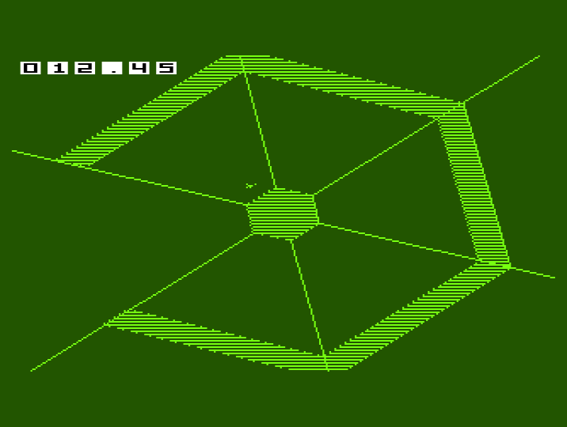
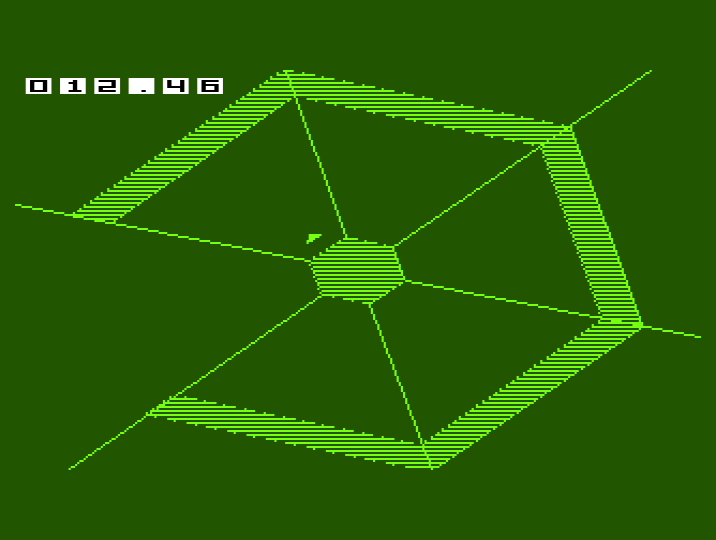
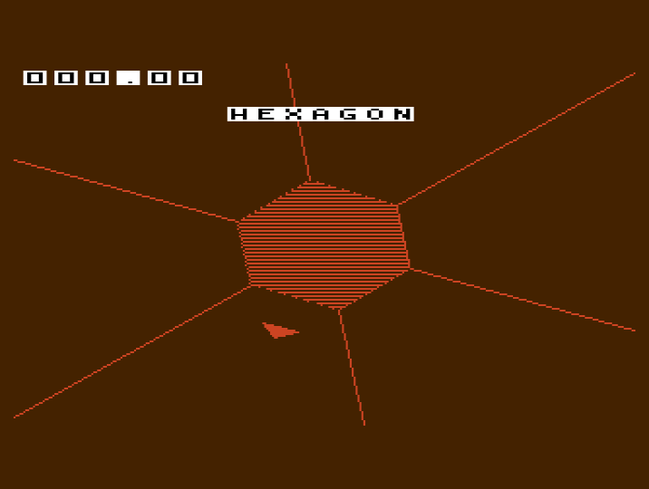
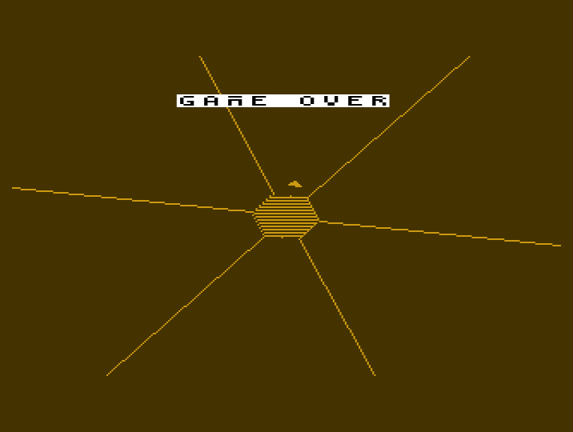
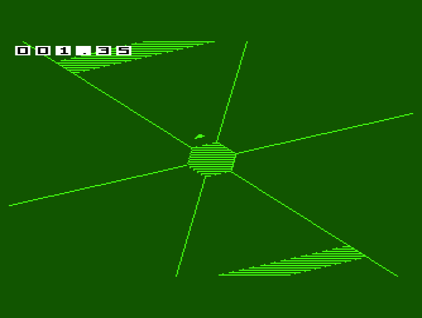

# Renderer benchmark — 20 September 2026

The endpoint table and linear shared-edge lookup improve rendered game-frame
throughput by **7.2–7.7% in Hexagon** and **9.4–9.5% in Hexagonest** in the
workloads tested. FS-UAE and Copperline agree closely.

| Emulator | Stage | Video | Before FPS | After FPS | Gain | Mean loop work, ms |
| --- | --- | --- | ---: | ---: | ---: | ---: |
| FS-UAE 3.1.66 | Hexagon | PAL | 31.46 | 33.74 | 7.26% | 31.57 → 29.31 |
| FS-UAE 3.1.66 | Hexagon | NTSC | 31.89 | 34.28 | 7.50% | 31.22 → 29.03 |
| FS-UAE 3.1.66 | Hexagonest | PAL | 25.07 | 27.46 | 9.54% | 39.78 → 36.30 |
| Copperline 0.21.0 | Hexagon | PAL | 31.44 | 33.70 | 7.18% | 31.61 → 29.36 |
| Copperline 0.21.0 | Hexagon | NTSC | 31.77 | 34.23 | 7.74% | 31.36 → 29.06 |
| Copperline 0.21.0 | Hexagonest | PAL | 25.05 | 27.41 | 9.42% | 39.81 → 36.37 |

## Configuration and workload

- Stock 68000, OCS, 512 KiB Chip + 512 KiB Slow RAM, no Fast RAM/JIT.
  FS-UAE CPU/memory/blitter cycle-exact settings enabled; Copperline uses
  `pacing_budget = "cycles"` and the A500OCS model.
- Release compilation: `BUILD_DEBUG=0`, `CHEAT_MODE=0`, music and SFX enabled.
  Music is the accepted 12 kHz, 96-slice bank at
  `scratchpad/audio/courtesy/pcm_reuse/96`, **not** the larger stale
  `out/courtesy` default. Copperline host audio output is muted, but guest
  Paula DMA, interrupts, buffer copying and cue lookup remain enabled.
- Each isolated build automatically starts, fixes the RNG seed to `0x2545`,
  supplies no movement input and clears the collision death flag after running
  the collision calculation. This lets both variants exercise the same seeded
  wall sequence through approximately 60 simulation seconds without a steering
  assistant. Collision, wall updates, HUD, palette, music and rendering execute.
- The stop condition is checked between display frames at `time_seconds >= 60`.
  A frame can contain multiple simulation ticks: FS-UAE runs end at 3,600–3,602
  ticks. These are representative survival workloads, not recordings of human
  play or an exhaustive worst-case search. Displayed snapshots and audio-cue
  samples can differ because faster rendering samples the simulation more often.
- Peak world record counts were 32 (Hexagon) and 34 (Hexagonest). The runs cover
  normal stages; no sustained hyper-stage performance claim is made.

## Measurement

The guest counts completed render-loop iterations and their incoming VBlank
intervals while in playing mode. FPS is `frames * nominal_refresh / vblanks`,
using 50 Hz PAL / 60 Hz NTSC. This measures rendered game frames, not host
presentation rate or the emulator FPS overlay. FS-UAE warp only accelerates
host execution; guest cycle timing remains enabled.

A raster/VBlank timestamp measures work after the frame wait through buffer
rotation. The mean-work column excludes deliberate VBlank waiting and includes
simulation, HUD, rendering and DMA waits. It is raster-line resolution and does
not include the completion of the asynchronously started next-buffer clear.
Counters add a small identical instrumentation cost to both builds. Window
boundaries use incoming frame intervals, so the first/last interval can differ
by one rendered frame; this is not sub-frame precision benchmarking.

The unoptimised PAL Hexagon run was repeated in **both** emulators: frame counts,
VBlank counts, accumulated work, maximum work and late-interval counts were
identical to the initial run. Cross-emulator agreement is additional evidence,
not a substitute for a physical A500 measurement.

## Baseline and artifacts

The before build reconstructs revision
`d57eb1a4da2bc0526d81ca320dd148db3aa242ea` with the sector-line extension already
applied: both builds draw lines to the screen edge. It uses the original
exhaustive neighbour searches and calculates spoke intersections every frame.
The after build uses the cached endpoints and linear shared-edge pass. Both
receive the same benchmark-only instrumentation. No benchmark survival/input
changes were made to the production source tree.

Raw counters, executable SHA-256 hashes and configuration metadata are retained
in [render_benchmark_results.json](render_benchmark_results.json).
Local full source copies, executables, logs, generated FS-UAE configurations and
binary counter dumps are under `scratchpad/frame_benchmark/`:

- `prepare.py`: constructs isolated before/after sources and instrumentation.
- `before/` and `after/`: full build inputs; `out/stage0.exe` and
  `out/stage2.exe` are the exact measured executables.
- `run_fsuae.py`: runs the repeat, Hexagonest and NTSC cases, watches for the
  guest counter file, and terminates only the emulator instances it starts.
- `copperline-*.log`: guest summaries from Copperline; successful measured runs
  end with `program returned 0`.
- `fsuae-*/hd/bench.bin`: twelve big-endian 32-bit counters; field names and
  decoded values are in the JSON.
- `report.py`: decodes the raw outputs and calculates the table.

The binaries can be rerun directly using the retained FS-UAE configurations, or
with Copperline's `--run`, `--run-stack 16384`, `--exit-on-return`, A500OCS memory
settings and `--screenshot-after 90 <timeout.png>` (headless run time limit).
Set `RUST_LOG=info` to retain Copperline's guest summary. PAL and NTSC must be
selected explicitly. These benchmark executables intentionally survive hits
and exit after the measurement; they are not release game binaries.

The result is a measurable improvement, but dense Hexagonest rendering is still
well below a full PAL refresh rate. Further profiling is needed to attribute
remaining time to projection, clipping, blitter setup and actual DMA work.

## Follow-up stage profile

Separate instrumented builds of the optimised renderer locate remaining work.
The same seeded PAL workload and accepted music/SFX bank are used. Values below
are **mean milliseconds per rendered frame**, not per simulation tick.

| Stage | FS-UAE Hexagon | FS-UAE Hexagonest |
| --- | ---: | ---: |
| Input, simulation and HUD update | 7.56 | 10.03 |
| Span projection, sorting, merging and shared-edge flags | 5.36 | 7.31 |
| Wall corner projection, clipping, line submission and waits | 9.04 | 11.73 |
| Hub and player | 2.33 | 2.53 |
| Fill submission and completion wait | 3.80 | 3.90 |
| Sector-line drawing and completion wait | 1.33 | 1.45 |
| Remaining frame tail | 1.37 | 1.34 |

The profiling counters and cross-check are retained in
[render_profile_results.json](render_profile_results.json). Source snapshots,
profiling binaries and outputs are under `scratchpad/frame_benchmark/profile/`,
`fsuae-profile-stage*-pal-coarse/`, and `copperline-profile-stage2.log`.

### Interpretation and overhead

Wall drawing remains the largest rendering block. Span preparation is also
substantial: the compiled `pc_project_spans()` calls `__divsi3` separately for
`distance / 5` and `width / 5` for each retained wall. A bounded 68000 `divs.w`
fast path, with an exact fallback for values whose quotient does not fit, is a
specific next experiment. Its savings have **not** yet been measured, and span
preparation also includes sorting, merging and neighbour-flag construction.

Next candidates are reuse of shared sector directions/corners, followed by a
fully-visible-edge clipping fast path. Fill costs about 3.9 ms in both stages;
it does not explain most of the additional Hexagonest time. Sector lines are
now a relatively small part of the total.

Timing hooks affect code generation and scheduling. The coarse profile runs at
31.97 FPS in Hexagon and 25.87 FPS in Hexagonest, versus the unprofiled 33.74 and
27.46 FPS: approximately 5–6% instrumentation slowdown. Treat these timings as
bottleneck attribution, not precise predictions of savings. Interrupt work is
charged to whichever section it interrupts. Simulation may advance multiple
ticks per rendered frame. Small gaps between timers and hook overhead mean the
rows are not an exact partition of the original uninstrumented frame time.

The profile explicitly completes fill and the final spoke at section boundaries;
normal code waits at the immediately following line-mode/clear setup instead.
The asynchronous next-buffer clear remains excluded from tail completion time.
An earlier detailed profile also timestamps individual walls and clipping calls
once per 32 frames. Its nested timer overhead makes those sampled absolute
costs unsuitable for direct addition to this table; they are retained only as
diagnostic artifacts in `fsuae-profile-stage2-pal/`.

This profiling pass changes no production rendering or gameplay code.

## Guarded hardware-division optimisation

The projection now uses 68000 `DIVS.W` for dividends in [-163840, 163839],
whose quotients fit in a signed 16-bit word. An unsigned range check avoids
signed-overflow issues; larger coordinates retain the original 32-bit software
division. The low-word quotient is sign-extended and the remainder discarded,
preserving C truncation toward zero and the existing separate distance/width
rounding. No simulation arithmetic, wall ordering or geometry is changed.

Unprofiled benchmarks against the preceding optimised renderer:

| Emulator | Workload | Previous FPS | New FPS | Additional gain |
| --- | --- | ---: | ---: | ---: |
| FS-UAE 3.1.66 | Hexagon NTSC | 34.28 | 36.98 | 7.86% |
| FS-UAE 3.1.66 | Hexagon PAL | 33.74 | 36.18 | 7.21% |
| FS-UAE 3.1.66 | Hexagonest PAL | 27.46 | 29.83 | 8.65% |
| Copperline 0.21.0 | Hexagonest PAL | 27.41 | 29.80 | 8.72% |

The Hexagonest FS-UAE run repeated exactly (1,790 frames / 3,000 VBlanks,
including identical work and late-interval counters). The same hardware,
accepted audio bank, deterministic survival workload, instrumentation and
measurement limits described above apply. The checking executable's timing
is excluded: it contains extra test code/data. Only the clean benchmark build
is used in the table.

Validation: the full host suite passes. `tests/projection_checks.c` is wired
into both host and optional target core checks. Host coverage includes 327,701
consecutive signed distances and varying widths. Copperline executed the real
68000 path over 40,001 consecutive signed distances plus explicit positive and
negative fast-path boundaries, non-multiples of five and 32-bit extrema;
`DIVISION_CHECK 0` confirms agreement with independent C division through the
public projection API. Tests exercise both distance and width calculations.

[Raw division benchmark results](render_division_benchmark_results.json) retain
counts, hashes and comparisons. The isolated build is under
`scratchpad/frame_benchmark/division/`, with `run_division.py` and
`division_report.py` alongside it. Production `out/hexagon.adf` and its packed
compatibility copy were rebuilt with the accepted music bank, release flags
and the no-cheat audit. Runtime checking and automatic survival remain confined
to the isolated benchmark executables.

## Cached sector directions

Sector sine/cosine values are now cached once per frame and shared by wall
corners, hub vertices and spoke origins. `direction_to_cartesian()` retains the
existing 68000 multiply, Q14 truncation and pixel-aspect correction. Player
geometry keeps its independent angles. The final wall boundary still wraps to
sector zero, preserving the morph closure. The six sine/cosine pairs occupy
24 bytes of ordinary RAM (the previously unused arrays are now live).

Unprofiled results against the hardware-division renderer:

| Emulator | Workload | Previous FPS | New FPS | Additional gain |
| --- | --- | ---: | ---: | ---: |
| FS-UAE 3.1.66 | Hexagon PAL | 36.18 | 37.00 | 2.26% |
| FS-UAE 3.1.66 | Hexagon NTSC | 36.98 | 37.92 | 2.54% |
| FS-UAE 3.1.66 | Hexagonest PAL | 29.83 | 30.68 | 2.85% |
| Copperline 0.21.0 | Hexagonest PAL | 29.80 | 30.67 | 2.91% |

The full host suite passes. Optional target core checks now include
`tests/trig_checks.c`; Copperline executed all 65,536 angles with radii varying
across 0–2047, comparing the cached-direction helper against an independent
signed Q14 C formula and the polar helper. `TRIG_CHECK 0` confirms matching
coordinates. Check-build frame counts are excluded from the performance table.
The release ADF was rebuilt with the accepted music asset and no-cheat audit.

A fully-visible-edge clipping shortcut was tested first. Despite matching the
old line/fill operations in 1,002,401 host cases, it reduced FS-UAE Hexagonest
throughput from 29.83 to 28.69 FPS. That change was removed. No claim is made
about the exact cause of the regression; additional bounds branches and changed
code generation are possible factors.

[Raw direction-cache results](render_directions_benchmark_results.json) retain
counters, binary hashes and the rejected trial. Local experiment files remain
under `scratchpad/frame_benchmark/clipfast/` (the directory name predates the
switch to direction caching); the retained performance binaries are
`out/stage0.exe` and `out/stage2.exe`. The `fsuae-clipfast-stage2-pal` output is
the rejected clipping trial; paths ending `pal-directions` and stage0 `ntsc`
are direction-cache runs. `copperline-directions-stage2.log` is the independent
performance cross-check, and `copperline-trig-check.log` is arithmetic validation.
The existing workload, timing resolution and emulator limitations still apply.

## Further experiments rejected

Two additional optimisations were measured against the retained direction-cache
renderer. Neither was kept:

| Experiment | Workload | Retained FPS | Trial FPS | Change |
| --- | --- | ---: | ---: | ---: |
| Per-sector projected-corner cache | Hexagonest PAL | 30.68 | 24.83 | -19.07% |
| Sort spans separately by sector | Hexagonest PAL | 30.68 | 30.78 | +0.31% |
| Sort spans separately by sector | Hexagon PAL | 37.00 | 36.88 | -0.30% |
| Sort spans separately by sector | Hexagon NTSC | 37.92 | 37.73 | -0.50% |

The corner-cache experiment used 16 direct-mapped entries per sector, keyed by
scaled radius and a per-frame generation. It invalidated after camera/rotation
changes and on generation wrap. Its lookup/storage overhead and changed code
generation are possible causes of the regression; cache hit rates were not
measured, so the exact cause is unproven. This result rejects that implementation,
not every possible method of sharing projected geometry.

Sector-grouped sorting scanned the world once per sector and insertion-sorted
only inside that sector's range. It preserved the original projected/merged
span output in 8,000 generated-world differential checks, but the small gain in
the heavy stage did not carry over to Hexagon. The original sorting was restored.

[Raw rejected-experiment results](render_rejected_experiments.json) preserve
counts and executable hashes. Both use the same release-style deterministic
survival workload as the preceding benchmarks. The corner trial is retained in
`scratchpad/frame_benchmark/fsuae-corners-stage2-pal/hd/bench`; later `corners`
trial paths contain sector-grouped sorting. Production source and the previously
built release disk retain the preceding measured optimisations. User HUD edits
were not changed by these experiments.

## HUD CPU optimisation

HUD glyphs and banners were already prebuilt sprites. This change reduces CPU
formatting and Copper-list setup work without changing artwork or DMA layout:

- Select displayed glyphs once after the simulation-tick loop, instead of after
  every catch-up tick. `hud_tick()` only derives the visible glyph selection.
- Recompute seconds digits only when the clamped seconds value changes.
- Precompute all 60 centisecond digit pairs during HUD initialisation. The
  historical arithmetic remains as a fallback for out-of-contract frame values.
- Snapshot mode/banner selection once per Copper-list emission, selecting the
  banner pointer array outside the sprite-channel loop. All 110 Copper words,
  including the lower-row WAIT and explicit POS/CTL reloads, are preserved.

Matched before/after binaries include the current user-edited HUD artwork:

| Emulator | Workload | Previous FPS | New FPS | Additional gain |
| --- | --- | ---: | ---: | ---: |
| FS-UAE 3.1.66 | Hexagon PAL | 37.00 | 37.45 | 1.22% |
| FS-UAE 3.1.66 | Hexagon NTSC | 37.92 | 38.42 | 1.32% |
| FS-UAE 3.1.66 | Hexagonest PAL | 30.68 | 31.15 | 1.52% |
| Copperline 0.21.0 | Hexagonest PAL | 30.67 | 31.12 | 1.47% |

These are whole-game throughput gains; sprite rendering remains hardware-driven.
The cache uses 60 bytes for centisecond pairs and two bytes for the cached seconds
value. It resets when the HUD is initialised. Existing benchmark timing and
workload limits apply.

The full host suite passes. A host harness compiles the actual old/new HUD logic
with identical mocked game state and sprite buffers. All 353,536 timer cases
match, covering 0–1199 seconds at every valid frame in all modes and every 16-bit
frame value through the fallback. All 37,440 generated Copper lists match word
for word, covering four modes, six profiles, banner/flash boundaries, locks,
record flashing and missing buffers; `hud_flash_now()` also matches. The harness
uses representative host pointer values and preserves the 32-bit emitted pointer
encoding; the actual target builds and gameplay are exercised by both emulators.

[Raw HUD results](hud_benchmark_results.json) preserve binary hashes and counters.
Matched source copies and executables are under
`scratchpad/frame_benchmark/hudbaseline/` and `hudfast/`. Preparation, runs,
comparison checks and reporting are retained alongside them as `prepare_hud.py`,
`run_hud.py`, `check_hud.py` and `hud_report.py`. User font/layout edits were
preserved. The release ADF and packed compatibility copy were rebuilt with the
accepted music bank and passed the no-cheat audit.

## Alternate-row polygon fill investigation (2026-09-20)

The existing descending in-place XOR fill can process only even screen rows:
round the last seeded row down to even, return if it lies below the first seeded
row, set height to `(hi - lo) / 2 + 1`, and set both A and D modulos to
`SCREEN_WIDTH_BYTES` (40). Width stays 20 words. Descending mode subtracts the
positive modulo, skipping an additional row after every processed row. Fill carry
restarts per row, so there is no dependency on filling intervening rows.
See the [Commodore Hardware Reference Manual, chapter 6](https://www.theflatnet.de/pub/cbm/amiga/AmigaDevDocs/hard_6.html).

Fixed screen parity avoids the stripes switching rows as polygon bounds change.
A host check covered all 40,401 combinations of lower bound 0–200 and upper
bound -1–199, verifying selected rows and accessed word addresses, including
empty and odd-only bands. Actual target executables ran in both emulators.

| Emulator | Workload | Normal FPS | Alternate-row FPS | Gain |
| --- | --- | ---: | ---: | ---: |
| FS-UAE 3.1.66 | Hexagon PAL | 37.45 | 40.33 | 7.70% |
| FS-UAE 3.1.66 | Hexagon NTSC | 38.42 | 41.89 | 9.05% |
| FS-UAE 3.1.66 | Hexagonest PAL | 31.15 | 33.70 | 8.19% |
| Copperline 0.21.0 | Hexagonest PAL | 31.12 | 33.70 | 8.30% |

These use the existing deterministic 60-second survival workload with music,
512 KB Chip + 512 KB Slow RAM and the matched HUD-optimised baseline. FS-UAE
baseline cases were rerun; the Copperline baseline is the preceding HUD run.
FPS is guest frames × nominal refresh / elapsed VBlanks, not host throughput.
Single runs establish an indicative gain, not statistical confidence intervals.

This halves filled rows (subject to odd band boundaries), not total rendering
work. Seed edges, spokes, clear, HUD and simulation still run normally. Skipped
rows retain seed pixels, so they are not completely blank. Walls, hub and player
all share this fill: the small player marker becomes less solid. The sprite HUD
is unaffected. Producing completely blank odd rows or keeping the player solid
would require additional changes and has not been benchmarked here.

At the time of this isolated experiment, production code and the normal release
ADF were unchanged; the integration below supersedes that status. The trial is retained
as [an applicable patch](alternate_fill.patch), with [raw counters and executable
hashes](alternate_fill_benchmark_results.json). The patch records the change against the pre-striping renderer; it is already
applied by the integration below and should not be applied again. Isolated benchmark sources and stage executables
are in `scratchpad/frame_benchmark/alternatefill/`; their automatic input and
survival changes are benchmark-only. The screenshot was captured at 20 seconds
of emulator time (12.45 on the game timer); its screenshot-triggered exit is
separate from the completed throughput runs.

## Solid player sprite with striped fills (2026-09-20)

Alternate-row fill is now enabled in production. Walls and hub keep the stripe
pattern; the player is removed from the shared fill and composited as an opaque
triangle with transparent surroundings, above the playfield. Collision and motion
logic are unchanged. Inclusive triangle rasterisation preserves the nose and
horizontal edges instead of leaving half the tiny marker unfilled.

The player uses channels 6/7, reloaded by the Copper at display row 34, after the
banner at rows 24–31 and its terminator. The timer/banner's existing 110-word
Copper prefix is unchanged; the new reload adds 18 words. Player colour 31 tracks
scene foreground, including white flashes, without changing HUD colours 29/30.
The display already places sprites above the playfield. At most two adjacent
16-pixel sprites are used, accommodating the menu zoom as well as gameplay.
The second channel is parked when the marker fits in one sprite.

The triangle uses the existing world angle, camera zoom, pulse translation and
shake offsets. CPU Bresenham row bounds avoid per-row division. Three sprite
pairs consume 816 bytes of Chip RAM and rotate once with each completed frame,
so sprite DMA never reads a buffer being repainted. Shape preparation happens
after wall fill/spokes, before the paired playfield and sprite pointers are
published. A clipped solid CPU overlay handles positions above row 36, partially
offscreen positions, or failure to allocate sprite buffers. Current zoom bounds
fit within the 32×32 capacity; oversized geometry is rejected defensively.

| Emulator | Workload | Original solid fill | Stripes alone | Stripes + solid player | Net gain |
| --- | --- | ---: | ---: | ---: | ---: |
| FS-UAE 3.1.66 | Hexagon PAL | 37.45 | 40.33 | 39.27 | 4.86% |
| FS-UAE 3.1.66 | Hexagon NTSC | 38.42 | 41.89 | 40.53 | 5.50% |
| FS-UAE 3.1.66 | Hexagonest PAL | 31.15 | 33.70 | 32.71 | 5.01% |
| Copperline 0.21.0 | Hexagonest PAL | 31.12 | 33.70 | 32.69 | 5.07% |

These are the same deterministic 60-second survival workloads and stock 1 MB
A500 configurations described above, with the accepted music bank. Earlier
baseline runs are reused. Sprite preparation costs some of the fill saving;
whole-game throughput remains about 5% higher than the original solid fill.
These are single-run emulator measurements, not real-hardware results.
[Raw counters and executable hashes](player_sprite_benchmark_results.json).

Validation: the full host suite passed; the new `make test-player-shape` covers
known triangles, degenerate points/lines, both sprite columns, oversized input,
10,000 random triangles, all six vertex permutations and translation invariance.
The triangle checks also passed UndefinedBehaviorSanitizer. An optional
AddressSanitizer run stalled in macOS runtime/shadow-memory initialisation before
entering the test and was terminated; it is not counted as a pass.
The HUD differential harness verified all 353,536 timer cases and 37,440 Copper
lists with an unchanged HUD prefix and the new player reload. Both emulators
completed target benchmark runs. Copperline screenshots confirm gameplay, the
larger menu player alongside the title/timer, and the game-over banner. The
last check uses normal collision with the game-over state held for capture in
an isolated visual harness. The title capture uses the actual packed release;
its decompression/startup completed before the 60-second capture.

The release `out/hexagon.adf` and packed executable were rebuilt and passed the
no-cheat audit. Survival/automatic-input/state-hold code exists only in isolated
benchmark/visual copies. Preparation and comparison scripts are retained under
`scratchpad/frame_benchmark/prepare_playersprite.py`, `run_playersprite.py` and
`check_player_hud.py`; stage executables live in `playersprite/out/` there.

## Prerendered gameplay player (2026-09-20)

The player now selects one of 128 immutable sprite images at the normal gameplay
zoom (128/256). Images are generated once after the actual sine table is ready,
using the existing triangle rasteriser. The Copper points directly to their
pixel data: no triangle edge walk or sprite pixel copy runs in the steady-state
player path. It still publishes the position alongside the matching playfield.

Each pose reserves 16 rows of two data words plus a zero terminator: 68 bytes,
or **8,704 bytes (8.5 KiB) of additional Chip RAM**. Bounds and anchor offsets
use another 1,024 bytes of ordinary data memory. Existing live sprite buffers
remain for other zoom levels. Allocation/capacity failure falls back to the live
renderer, as do the menu, zoom transitions and positions requiring software
clipping or overlap with the HUD. All allocations are released after OS DMA is
restored.

Orientation rounds to the nearest 2.8125 degrees (maximum angular error 1.40625
degrees). The orbit anchor still uses the original angle, and pulse/shake still
translate it at the original precision. At the 128 exact pose angles, the cached
image and placement match the live rasteriser. Between those angles the triangle
orientation is intentionally quantised; this is not pixel-identical rendering
for every possible angle. Collision and simulation are unchanged.

Both baseline and candidate were freshly built with the current sound-startup
fix, HUD artwork and accepted music bank. The standard 60-second deterministic
survival workload, stock 512 KB Chip + 512 KB Slow A500 and guest-frame/VBlank
FPS calculation are unchanged:

| Emulator | Workload | Live sprite FPS | Prerendered FPS | Gain |
| --- | --- | ---: | ---: | ---: |
| FS-UAE 3.1.66 | Hexagon PAL | 39.28 | 40.95 | 4.24% |
| FS-UAE 3.1.66 | Hexagon NTSC | 40.51 | 42.61 | 5.19% |
| FS-UAE 3.1.66 | Hexagonest PAL | 32.69 | 34.25 | 4.76% |
| Copperline 0.21.0 | Hexagonest PAL | 32.69 | 34.20 | 4.61% |

[Raw counters and binary hashes](player_prerender_benchmark_results.json).
These are single-run emulator results. In the FS-UAE Hexagonest candidate run,
the auxiliary raster-work timestamp underflowed at a frame boundary (max work
4294967290); its work-line totals/maxima must not be interpreted as timings.
The independent frame/VBlank counters used for FPS are unaffected. Copperline's
independent run corroborates throughput at 34.20 FPS.

Validation: the full host suite passed. `make test-player-shape` now also runs
`tests/player_prerender_test.py`, which compiles the actual renderer's player
functions with host hardware/trig substitutes. It checks all 128 exact poses
against the live renderer, all 65,536 angle selections including wraparound,
immutable atlas pixels, zoom/viewport fallback, and allocation failure. Host
trig substitutes do not prove target arithmetic; both emulators exercise the
real 68000 trig functions in the completed target runs. The HUD harness passed
353,536 timer cases and 37,440 Copper lists, with pixel pointers deliberately
separate from position headers. Copper list length remains unchanged.

The combined music/effects release ADF and packed executable were rebuilt with
the no-cheat audit passing. Benchmark copies remain under
`scratchpad/frame_benchmark/prerenderbaseline/` and `prerender/`; preparation,
runs and HUD checks are retained as `prepare_prerenderbaseline.py`,
`prepare_prerender.py`, `run_prerender.py` and `check_prerender_hud.py`.

The actual packed release also booted to the menu in Copperline with 512 KB
Chip + 512 KB Slow RAM; the live menu player and HUD remained visible. Capture:
`scratchpad/frame_benchmark/prerender-menu.png` (60 seconds of emulator time).
